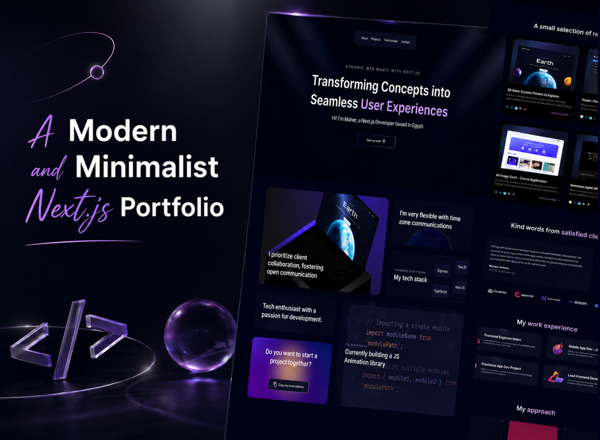

<h1 align="center">
  
  Maher's Portfolio
</h1>

<p align="center">
  <em>A modern, animated, and fully responsive developer portfolio built with Next.js 16, React 19, and a rich set of interactive 3D/UI experiences.</em>
</p>

<div align="center">
  
  
  
  
  
  
  
</div>

---

## 📌 Table of Contents
 
- [Overview](#-overview)
- [Screenshots](#️-screenshots)
- [Tech Stack](#️-tech-stack)
- [Project Structure](#-project-structure)
- [Core Features](#-core-features)
- [Sections Breakdown](#-sections-breakdown)
- [Getting Started](#-getting-started)
- [Error Monitoring](#-error-monitoring)
- [Useful Links](#-useful-links)

---

## ✨ Overview

**Maher's Portfolio** is a modern, minimalist developer portfolio designed to showcase projects, work experience, and client testimonials through a series of polished, animated sections. The site combines **Aceternity UI**-style interactive components (spotlight effects, 3D pin cards, moving borders, canvas reveal effects) with a real-time **3D interactive globe** and smooth **Framer Motion** animations, all wrapped in a dark-themed, fully responsive layout.

Key highlights:

- 🎯 **Interactive hero section** with animated spotlight and text-generation effect
- 🌍 **3D interactive globe** visualizing global connections using Three.js
- 🗂️ **Bento-grid "About" section** with Lottie confetti micro-interaction
- 🪪 **3D tilt project cards** with live-site links and tech stack icons
- 💬 **Infinite auto-scrolling testimonials carousel**
- 🧭 **Animated work experience cards** with moving gradient borders
- 🎨 **Canvas reveal effect** for the "My Approach" process section
- 🌗 **Dark mode** support via `next-themes`
- 🐞 **Production error monitoring** via Sentry

---

## 🖼️ Screenshots

### 🖥️ Desktop View



---

## 🛠️ Tech Stack

| Category | Tools & Libraries |
|---|---|
| **Core Framework** | Next.js 16.2.10 (App Router), React 19.2.4, TypeScript 5 |
| **Styling** | Tailwind CSS 4, `tailwind-merge`, `class-variance-authority`, `tw-animate-css` |
| **UI Components** | shadcn/ui, Aceternity UI-style custom components (Spotlight, 3D Pin, Moving Border, Bento Grid) |
| **Animation** | Motion (Framer Motion), Lottie (`lottie-react`) for confetti micro-interactions |
| **3D / WebGL** | Three.js, `@react-three/fiber`, `@react-three/drei`, `three-globe` (interactive globe) |
| **Icons** | Lucide React, Tabler Icons |
| **Theming** | `next-themes` (dark mode) |
| **Error Monitoring** | Sentry (`@sentry/nextjs`) — client, server, and edge runtime instrumentation |
| **Linting** | ESLint 9, `eslint-config-next` |

---

## 📁 Project Structure

```
portfolio/
│
├── app/
│   ├── layout.tsx              # Root layout, fonts, theme provider
│   ├── page.tsx                 # Home page — composes all sections
│   ├── theme-provider.tsx       # next-themes wrapper
│   ├── global-error.tsx         # Sentry-wrapped global error boundary
│   └── globals.css              # Tailwind v4 theme tokens & keyframes
│
├── components/
│   ├── Hero.tsx                  # Landing section with spotlight + text effect
│   ├── Grid.tsx                  # "About" bento grid wrapper
│   ├── RecentProjects.tsx        # 3D pin project showcase
│   ├── Clients.tsx                # Testimonials + company logos
│   ├── Experience.tsx            # Work experience cards
│   ├── Approach.tsx               # Process/approach cards with canvas reveal
│   ├── Footer.tsx                 # Contact CTA + social links
│   ├── MagicButton.tsx            # Reusable gradient-border button
│   └── ui/
│       ├── bento-grid.tsx         # Bento grid + item components
│       ├── 3d-pin.tsx             # 3D tilt project card
│       ├── moving-border.tsx      # Animated gradient border button/card
│       ├── spotlight-new.tsx      # Hero spotlight animation
│       ├── text-generate-effect.tsx # Word-by-word text reveal
│       ├── infinite-moving-cards.tsx # Auto-scrolling testimonial cards
│       ├── canvas-reveal-effect.tsx  # WebGL dot-matrix reveal shader
│       ├── Globe.tsx / GridGlobe.tsx # Interactive 3D globe (three-globe)
│       ├── floating-navbar.tsx    # Scroll-aware sticky navigation
│       └── tailwindcss-buttons.tsx
│
├── data/
│   ├── index.ts                   # Nav items, projects, testimonials, experience
│   ├── globe.json                 # GeoJSON country data for the 3D globe
│   └── confetti.json              # Lottie animation data
│
├── lib/
│   └── utils.ts                   # `cn()` class-merging helper
│
├── instrumentation.ts             # Sentry server/edge init
├── instrumentation-client.ts      # Sentry browser init (Replay + Feedback)
├── sentry.server.config.ts
├── sentry.edge.config.ts
├── next.config.ts                 # Static export + Sentry webpack plugin
└── components.json                 # shadcn/ui configuration
```

---

## 🎯 Core Features

### 🏠 Landing & Navigation
- **Floating sticky navbar** that hides on scroll-down and reappears on scroll-up
- **Animated spotlight** background effect in the hero section
- **Word-by-word text generation** animation for the hero headline

### 🧩 About Me
- **Responsive bento grid** layout combining bio, tech stack, and an interactive 3D globe
- **Copy-email button** with a Lottie confetti burst on click

### 🪪 Recent Projects
- **3D tilt "pin" cards** (perspective hover effect) for each project
- Tech-stack icon stack and a direct "Check Live Site" link per project

### 💬 Testimonials & Clients
- **Infinite auto-scrolling** marquee of client testimonials (pause on hover)
- Row of partner/company logos

### 🧭 Work Experience
- Animated **gradient moving-border** cards for each role, using `useState`'s lazy initializer to randomize animation speed per card

### 🎨 My Approach
- Three-step process cards (**Planning → Development → Launch**) each revealed with a custom **WebGL dot-matrix canvas shader**

### 📨 Contact / Footer
- Call-to-action section with a "Let's get in touch" button (`mailto:` link)
- Social media icon links (GitHub, Twitter, LinkedIn)

### 🌗 Theming & Reliability
- **Dark mode by default** via `next-themes`, with system preference support
- **Sentry integration** across client, server, and edge runtimes for error tracking and session replay

---

## 🧭 Sections Breakdown

| Section | Component | Description |
|---|---|---|
| Navigation | `FloatingNav` | Sticky, scroll-aware nav bar |
| Hero | `Hero` | Intro headline, spotlight, CTA button |
| About | `Grid` → `BentoGrid` | Bio, tech stack, 3D globe, email copy |
| Projects | `RecentProjects` | 3D pin cards for featured work |
| Testimonials | `Clients` | Infinite scrolling reviews + company logos |
| Experience | `Experience` | Work history timeline cards |
| Approach | `Approach` | Development process, 3 animated cards |
| Footer | `Footer` | Contact CTA + social links |

---

## 🚀 Getting Started

### Prerequisites
- Node.js 20+
- npm / yarn / pnpm / bun

### Installation

```bash
# Clone the repository
git clone https://github.com/your-username/portfolio.git
cd portfolio

# Install dependencies
npm install
```

### Running the Project

```bash
# Start the development server
npm run dev

# Build for production (static export)
npm run build

# Start the production server
npm run start

# Lint the codebase
npm run lint
```

Open [http://localhost:3000](http://localhost:3000) in your browser to view the result.

### Customizing Content

Most personal content (projects, testimonials, work experience, nav links, and social links) lives in a single file:

```
data/index.ts
```

Update the `projects`, `testimonials`, `workExperience`, `companies`, and `socialMedia` arrays to reflect your own information.

---
 
## 🐞 Error Monitoring
 
This project ships with **Sentry** pre-configured across all Next.js runtimes:
 
- `instrumentation-client.ts` — browser errors, session replay, and user feedback widget
- `instrumentation.ts` + `sentry.server.config.ts` — Node.js server errors
- `sentry.edge.config.ts` — Edge runtime (middleware) errors
- `app/global-error.tsx` — global React error boundary that reports to Sentry
To connect your own Sentry project, replace the `dsn` value in each config file with your project's DSN.
 
---

## 🔗 **Useful Links**

### 🧑‍🏫 Tutorial & Inspiration

This project was built by following and learning from a tutorial by **Adrian Hajdin** from **JavaScript Mastery**.

* 📺 [YouTube Tutorial](https://www.youtube.com/@javascriptmastery)

* 🌍 [JavaScript Mastery Website](https://jsmastery.com/)

* 👨‍💻 [Adrian Hajdin on GitHub](https://github.com/adrianhajdin)

---

### 👨‍💻 Author

**Maher Elmair**

* 📫 [maher.elmair.dev@gmail.com](mailto:maher.elmair.dev@gmail.com)

* 🔗 [LinkedIn](https://www.linkedin.com/in/maher-elmair)

* ✖️ [X (Twitter)](https://x.com/Maher_Elmair)

* 🐙 [GitHub](https://github.com/maher-elmair)

* ❤️ Made with passion by [Maher Elmair](https://maher-elmair.github.io/My_Website)

---

### 🌐 **Live Preview**

🚀 **Check out the live version of the portfolio:**

👉 [3D Portfolio](https://3d-portfolio-ten-omega.vercel.app)

---

## 🙌 Thank You

If you found this project useful or inspiring, please consider giving it a ⭐️  
Pull requests, issues, and suggestions are always welcome 🙏

---

<h6 align="center"><i>Maher's Portfolio — Transforming concepts into seamless user experiences</i></h6>
